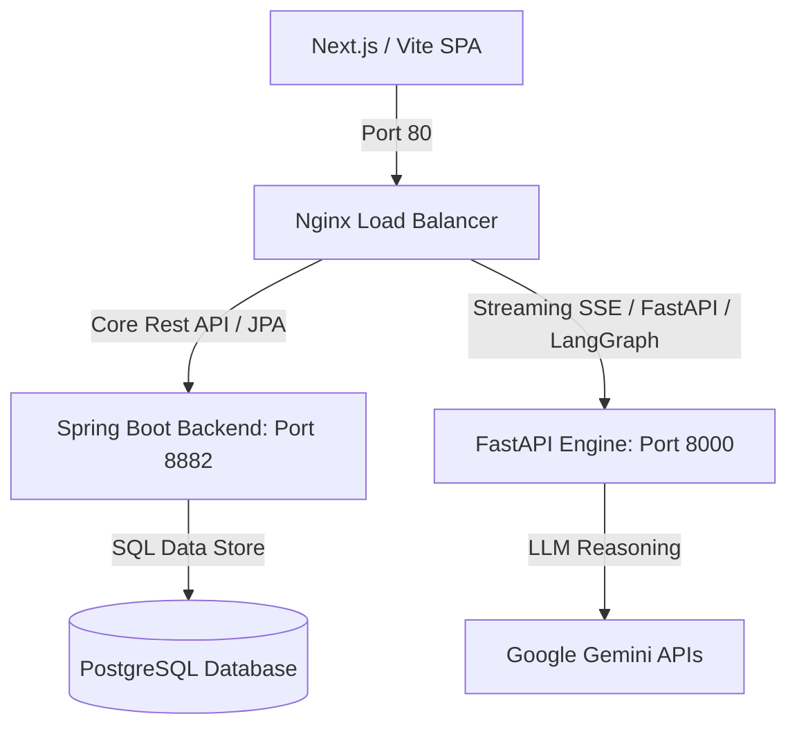
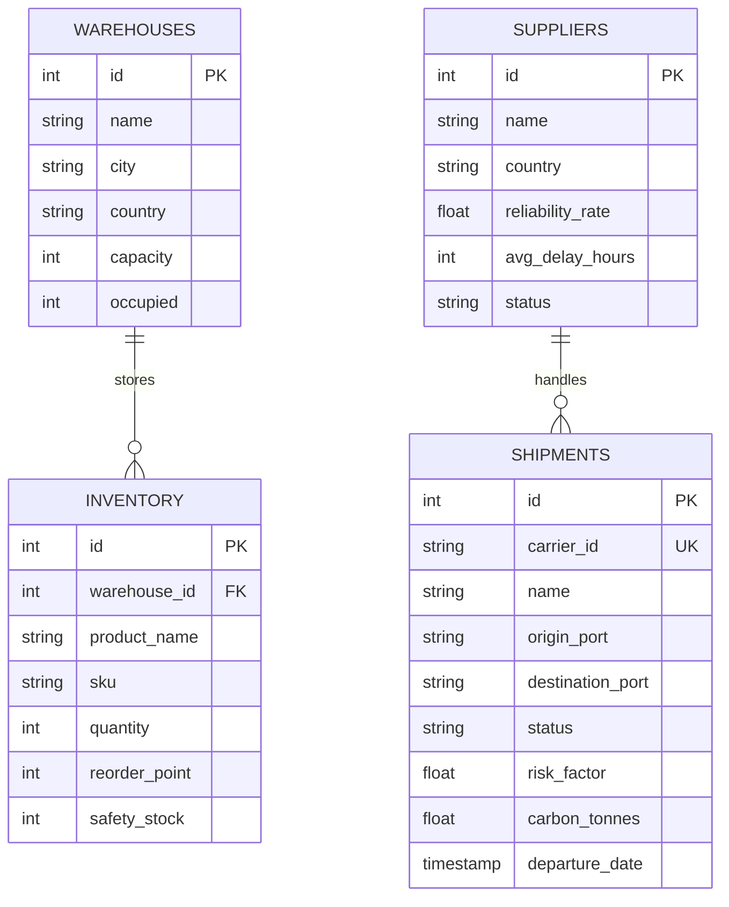

# AetherOS AI 🪐
> **Enterprise Autonomous Supply Chain Intelligence Platform**

AetherOS AI is a high-fidelity enterprise-grade supply chain operating system. It features live Digital Twin mapping, multi-agent AI collaborative routing, SHAP explainable models, and real-time dashboard tracking, designed for Fortune 500 energy, transport, and logistics firms.

---

## 🏛 System Architecture



### Component Details
1. **Frontend SPA (`/frontend`)**: Developed with React, TypeScript, Tailwind CSS, Framer Motion, and HTML5 Canvas (rendering the 3D Supply Chain Globe and Interactive Digital Twin Map).
2. **Core Backend (`/backend-springboot`)**: Layered Spring Boot app handling controller endpoint routing, JPA database mappings, transactional processes, and REST security.
3. **AI Core (`/backend-fastapi`)**: Python FastAPI server managing LangGraph multi-agent orchestration logs, delay forecasts, and streaming SSE responses.
4. **Database Schema (`/database`)**: Normal form PostgreSQL schema tracking active warehouses, suppliers registry, audit logs, and shipments.
5. **Gateway (`/devops`)**: Nginx reverse proxy routes traffic and handles CORS headers.

---

## 📊 Database ER Diagram



---

## 🚀 Getting Started

Ensure you have **Docker & Docker Compose** installed.

### 1. Configure Credentials
Create a `.env` file in the root directory:
```env
GEMINI_API_KEY=your_gemini_pro_api_key_here
```

### 2. Launch Stack
Run the following terminal command from the `/devops` directory:
```bash
docker-compose up --build
```
This builds and initializes:
- Nginx reverse proxy at `http://localhost`
- React SPA Client at `http://localhost:3000`
- Spring Boot core API at `http://localhost:8080`
- FastAPI model server at `http://localhost:8000`
- PostgreSQL instance running at port `5432` (seeded with initial datasets)

---

## ⚙ Developer Setup (No Docker)

### Frontend
```bash
cd frontend
npm install
npm run dev
```

### FastAPI AI Server
```bash
cd backend-fastapi
pip install -r requirements.txt
python app/main.py
```

### Spring Boot App
Requires Maven 3.8+ and JDK 17.
```bash
cd backend-springboot
mvn clean spring-boot:run
```
